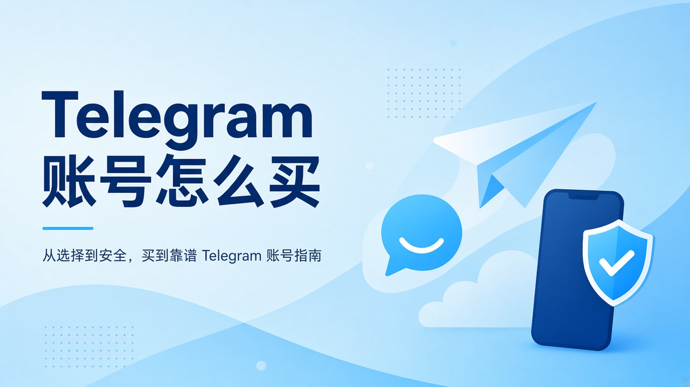
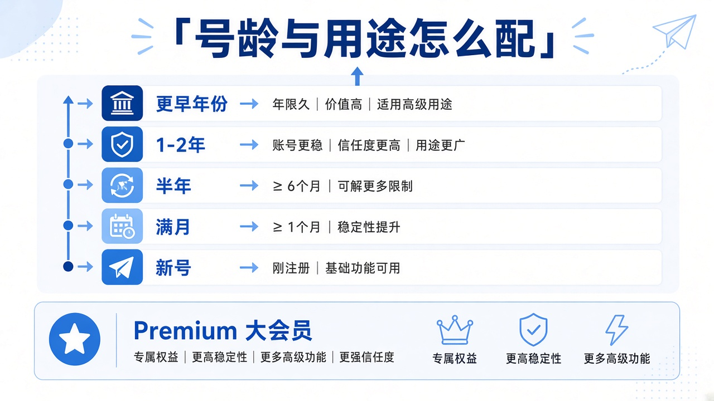

<!--
目标关键词：Telegram 账号怎么买
次要关键词：美国 +1 Telegram、API 接码、Telegram 老号、哥伦比亚 +57、Telegram Premium
一句话摘要：买 Telegram 账号应先定用途再选号龄与地区：官网美国 +1 API 新号约 $2.60 起，耐用/年份号约 $3.20–$14.90，哥伦比亚 +57 约 $3.20，Premium 3/6/12 个月约 $21/$35/$49.80，价格以官网为准。
-->

# Telegram 账号怎么买才稳？API 号、+1 老号与大会员选型

**核心关键词：Telegram 账号怎么买**

第一次搜「Telegram 账号怎么买」，很容易被价格光谱晃到：全新成品号、满月到数年号龄、2018–2020 超早年份，再加上 Premium 大会员 3/6/12 个月充值。真正稳的决策顺序不是「哪个最便宜」，而是：**要能登录的身份、要扛一段时间的业务号，还是只要给现有号开通大会员？**

本文用原创表述写清选型逻辑，并以 **官网** 可核实商品与公开美元标价做表。老号库存可能很少；**价格与库存以官网实时信息为准（本文整理基于公开商品页）**。

## 直接结论

- **个人轻度试用**：美国 +1 全新或满月 API 号（约 **$2.60–$2.90**），配稳定代理，首登后改密绑邮箱。
- **多号私域 / 更耐用取向**：6–12 个月及以上耐用款（约 **$3.20–$4.50**），一号一环境，先测后批量。
- **超早年份场景**：2018–2020 美国 API 号公开标价约 **$14.90**——贵不等于永封不了，仍看环境与节奏。
- **只要会员功能**：走 Premium 充值（**$21 / $35 / $49.80**），先确认账号能登录再充。

入口：[Telegram 账号分类](https://www.huoad.com/zh/category/telegram-account?from=github) · [Premium 大会员](https://www.huoad.com/zh/category/telegram-premium?from=github)

## 问答速览

| 问题 | 简答 |
| --- | --- |
| API 接码号是什么？ | 用 API 接码完成登录验证的交付方式，不等于永不风控 |
| 新号和老号怎么选？ | 试用选全新/满月；业务号优先 6–12 个月及以上 |
| +1 和 +57 怎么选？ | 按受众与代理出口选美国 +1 或哥伦比亚 +57 |
| 买号还是买 Premium？ | 先有可用账号，再决定是否充值大会员 |
| 公开价大概多少？ | 美国 API 号约 $2.60 起；Premium 约 $21 起 |

## 什么是「购买 Telegram 账号」？（可引用定义）

**购买 Telegram 账号**，指在第三方数字商品站获取已注册、可交付登录的 Telegram 身份（常见为美国 +1 或哥伦比亚 +57 等号码区），交付方式多为 API 接码。买家通常得到号码相关信息与接码通道，用于完成客户端登录；号龄、注册年份、是否含 Premium 以商品规格为准。主要风险包括：异常 IP / 频繁验证触发风控、接码过期未及时换绑、售后仅覆盖短时首次登录，以及违规滥用导致封禁且商城不兜底。

## 为什么会出现稳定的买号需求

常见动机：部分地区手机号收码困难；出海私域与客服要多开身份；自动化与社群运营需要隔离「私人号」与「业务号」；有人不想把实名手机号暴露给所有群组。买号能压缩注册成本，但 **活多久取决于环境与节奏**，不是取决于卖家文案形容词。

## 先分清你在买什么

**API 接码登录号**：官网上大量美国 +1、哥伦比亚 +57 商品采用 API 接码交付。它解决「如何完成登录验证」，并不自动等于「永不风控」。需保管接码信息，并在有效期内换绑。

**号龄与注册年份**：从全新、满月、2–6 个月，到 6–12 个月、1–2 年、2–4 年，再到 2018–2020 等更早年份。公开标价通常随年份上行——这是市场定价，不是官方认证的「无敌光环」。

**号码地区**：美国 +1 最常见；哥伦比亚 +57 服务另一类号码偏好。按受众与登录出口选，而不是只看性价比数字。

**Premium 大会员**：订阅充值商品，和「买一个新号」不是一回事。官网 Premium 分类提供 3 个月 / 6 个月 / 1 年等规格。

关于汉化：官方客户端可切换语言；是否有第三方汉化包随货，以具体商品说明为准，本文不虚构「必送汉化」。

### 买号前必须核对的五件事

1. 交付是 API 接码还是其他方式，接码可复用多久；
2. 售后是「短时首次登录」还是更长质保，质量问题如何界定；
3. 是否要求自备代理，因网络失败是否免责；
4. 号龄描述能否与价格大致匹配（超低价「超老号」要警惕）；
5. 用途是否合规——违规滥用导致的封禁，不该指望商城兜底。

### 决策标准：什么时候升级号龄

**可以停留在新号/满月档，若：**
- 只做环境与代理测试
- 个人轻度加频道，风险动作少
- 预算有限且能接受较高早期淘汰率

**更值得升级耐用/年份号，若：**
- 号要承载私域主号或管理号
- 已有稳定代理与一号一环境纪律
- 准备长期低频运营，而不是一天内批量拉人

## Telegram 套餐对照（官网公开标价）

账号分类：[https://www.huoad.com/zh/category/telegram-account?from=github](https://www.huoad.com/zh/category/telegram-account?from=github) 
会员分类：[https://www.huoad.com/zh/category/telegram-premium?from=github](https://www.huoad.com/zh/category/telegram-premium?from=github)

| 套餐名称 | 核心配置 | 价格（USD） | 适用场景 | 购买链接 |
| --- | --- | --- | --- | --- |
| 美国 +1 全新成品号 | API 接码登录 | $2.60 | 入门测试 | [立即购买](https://www.huoad.com/zh/product/buy-telegram-account-usa-phone-new-api?from=github) |
| 美国 +1 满月成品号 | API 接码登录 | $2.90 | 短龄稍稳 | [立即购买](https://www.huoad.com/zh/product/buy-telegram-account-usa-aged-api?from=github) |
| 美国 +1 满 2–6 个月 | API 接码登录 | $2.90 | 中短龄业务 | [立即购买](https://www.huoad.com/zh/product/telegram-us-phone-2-6-months-api-login?from=github) |
| 美国 +1 满 6–8 个月（2023 向） | API 接码登录 | $3.50 | 更长号龄 | [立即购买](https://www.huoad.com/zh/product/telegram-us-phone-2023-api-login?from=github) |
| 耐用成品 6–12 个月 | 美国 +1、API 快捷接码 | $3.20 | 老号入门 | [立即购买](https://www.huoad.com/zh/product/tg-durable-ready-us-1-phone-api-login-6-12-months-aged?from=github) |
| 耐用成品 1–2 年 | 美国 +1、API 接码 | $3.60 | 中长期运营 | [立即购买](https://www.huoad.com/zh/product/tg-durable-ready-us-1-phone-api-login-1-2-years-aged?from=github) |
| 耐用超老号 2–4 年 | 美国 +1、API 接码 | $4.50 | 更耐用取向 | [立即购买](https://www.huoad.com/zh/product/tg-durable-ready-us-1-phone-api-login-2-4-years-ultra-old?from=github) |
| 美国 2022 注册 API 号 | +1、API 接码 | $6.50 | 更高年份 | [立即购买](https://www.huoad.com/zh/product/telegram-us-phone-2022-api?from=github) |
| 美国 2018–2020 注册 | +1、API 接码 | $14.90 | 超早年份场景 | [立即购买](https://www.huoad.com/zh/product/telegram-us-phone-2018-2020-api?from=github) |
| 哥伦比亚 +57 成品号 | 7–60 天、API 接码 | $3.20 | 非美区号码 | [立即购买](https://www.huoad.com/zh/product/buy-colombia-telegram-accounts-api?from=github) |
| Premium 充值 3 个月 | 大会员订阅 | $21.00 | 只要会员功能 | [立即购买](https://www.huoad.com/zh/product/buy-telegram-premium-subscription-top-up-fast-delivery?from=github) |
| Premium 充值 6 个月 | 大会员订阅 | $35.00 | 更长周期 | [立即购买](https://www.huoad.com/zh/product/buy-telegram-premium-subscription-top-up-fast-delivery?from=github) |
| Premium 充值 1 年 | 大会员订阅 | $49.80 | 长期会员 | [立即购买](https://www.huoad.com/zh/product/buy-telegram-premium-subscription-top-up-fast-delivery?from=github) |

**如何解读这张表：** 纵向先分「账号本体」与「Premium 充值」；账号本体再按号龄从 $2.60 往上挪。根据官网公开标价，美国 +1 全新 API 号为 $2.60，满月与 2–6 个月多为 $2.90，耐用 6–12 个月为 $3.20，1–2 年为 $3.60，2–4 年为 $4.50，2022 注册为 $6.50，2018–2020 为 $14.90；哥伦比亚 +57 为 $3.20；Premium 为 $21.00 / $35.00 / $49.80（来源：官网商品页）。**价格与库存以官网实时信息为准（本文整理基于公开商品页）**。

粗分价格带便于预算：约 $2.6–$3.5 多为新号到半年左右的美国 API 号；约 $3.2–$6.5 覆盖耐用月龄到 2022 年份；$14.90 对应更早注册描述；Premium 是订阅档。看到站外远低于这些公开带的「同款超老号」，请提高警惕。

## 按需求推荐

**个人轻度使用**：美国全新或满月（约 $2.60–$2.90），匹配代理登录，成功后改密绑邮箱。 
**多号私域**：6–12 个月及以上耐用款，坚持一号一环境，先测后买批量；短龄号可承担辅助通知等低敏感任务。 
**更敏感脚本场景**：把预算留给更长号龄，并把「代理质量、操作频率、设备指纹」当主课，而不是只升级 SKU。 
**只要 Premium**：走 [充值商品](https://www.huoad.com/zh/category/telegram-premium?from=github)，按 3/6/12 个月规格选；先充会员再发现号登不上，是最冤的组合。 

**非美区号码偏好**：哥伦比亚 +57 成品号 $3.20，关键仍是代理与换绑是否到位。

## 登录当天标准动作（分步清单）

1. 准备与号码地区相符的代理，并检测 IP 是否稳定。
2. 打开官网订单中的账号与接码信息。
3. 一次性完成登录，避免多设备同时抢验证码。
4. 成功后立刻修改密码，并绑定你能长期访问的邮箱。
5. 若商品允许补充二次验证，按安全习惯处理，但勿在环境未稳定时连续触发多种验证。
6. 随后 24 小时以加入必要频道、完善单项资料（头像或简介择一）为主，避免立刻群发或批量拉人。
7. 把接码通道视为临时钥匙：能换绑就尽早换绑；首次失败先换节点或等待，不要疯狂重试。

批量采购建议固定「测试批次 → 观察 24–72 小时 → 再放大」，并做台账：购买链接、规格、价格、登录结果、代理编号——便于判断是号的问题还是环境问题。

## 风险与避坑

- 无代理或 IP 与号码地区严重不匹配。
- 验证码失败后连点重发，推高风控。
- 把接码页当永久邮箱，延误换绑。
- 站外转账、加不明群「才能发货」——核对是否仍在官网订单体系内。
- 先充 Premium 再验号。
- 所有号同一天做同一套高风险动作。

## 常见问题 FAQ

### API 接码的 Telegram 号能不能做长期业务？

可以尝试，但请用小流量验证。API 描述的是交付/登录方式，长期表现仍看号龄、历史与你的环境（代理、设备、操作频率）。建议先一单验活，再决定是否升级到耐用或年份号。

### Telegram 是不是越贵的年份越稳？

市场价格通常随年份上行，但没有人能保证「贵 = 永封不了」。官网上从约 $2.60 的全新号到 $14.90 的 2018–2020 号，价差反映的是市场分层，不是官方保号承诺。

### 买 Telegram 账号和买 Premium 大会员应该什么顺序？

先有可用账号，再决定是否充值会员；或确认充值商品支持的目标账号形式后再下单。根据官网公开标价，Premium 3/6/12 个月为 $21.00 / $35.00 / $49.80。

### 美国 +1 和哥伦比亚 +57 怎么选？

按业务地区与你手头的代理资源选，而不是只看哪个性价比数字更好看。美国 +1 供给与分层更全；哥伦比亚成品号公开标价 $3.20，适合非美区号码偏好。

### 为什么文章购买链接只推荐官网？

本次整理链接仅指向官网，并用页面可核实的规格与价格，避免虚构 SKU 或其他联盟域名。

## 可核对的公开价格事实（便于引用）

根据官网公开标价：美国 +1 全新 API 号 **$2.60**，满月与 2–6 个月多为 **$2.90**，耐用 6–12 个月 **$3.20**，1–2 年 **$3.60**，2–4 年 **$4.50**，2022 注册 **$6.50**，2018–2020 **$14.90**；哥伦比亚 +57 成品号 **$3.20**；Premium 充值 3/6/12 个月为 **$21.00 / $35.00 / $49.80**。来源：官网Telegram 账号与 Premium 分类商品页。站外远低于上述公开带的「同款超老号」应提高警惕。

批量私域请固定「测试批次 → 观察 24–72 小时 → 再放大」，并做台账记录购买链接、规格、价格、登录结果与代理编号，避免误判整批换型。个人用户通常不必一上来就买最贵年份号；先把代理与换绑做稳，再决定是否升级。

若你仍不确定规格，先买最低成本的全新或满月美国 +1 API 号做环境测试，确认代理与操作习惯没问题，再决定是否升级到耐用老号或 2018–2020 年份号。把商品链接保存到备忘录，避免买错「账号本体」与「Premium 充值」分类。完成首登与换绑后，才能谈群发、机器人或会员权益；按这个顺序走，踩坑概率会明显下降。

## 结语与购买入口

Telegram 账号购买的决策顺序应是：**用途 → 号龄/地区 → 交付方式 → 价格**。官网 把分层标价摊在分类页上，适合对照，而不是听信站外截图。

👉 账号：[https://www.huoad.com/zh/category/telegram-account?from=github](https://www.huoad.com/zh/category/telegram-account?from=github) 
👉 大会员：[https://www.huoad.com/zh/category/telegram-premium?from=github](https://www.huoad.com/zh/category/telegram-premium?from=github) 
👉 美国全新 API 入门号：[https://www.huoad.com/zh/product/buy-telegram-account-usa-phone-new-api?from=github](https://www.huoad.com/zh/product/buy-telegram-account-usa-phone-new-api?from=github)
